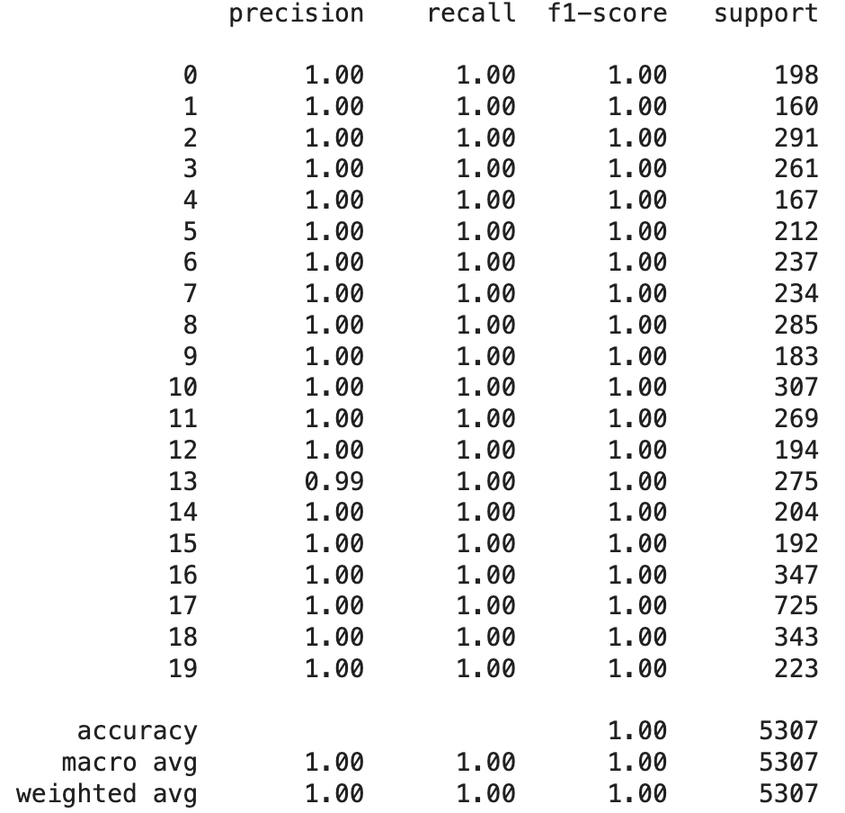
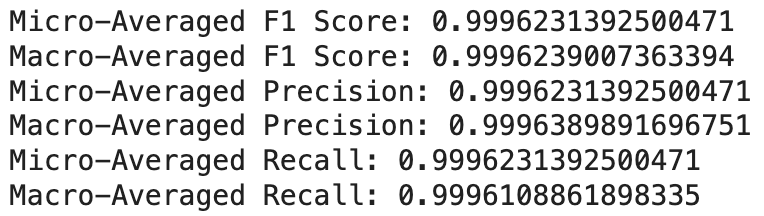

# Mal_InEx_GAN
 A Research on Malware (Malhub) classification with ExceptionNet and InceptionNet - creation of a GAN Model  

Image Type (GRAY scale)

1. Model-1 (Inception Net) `->` Use GAN `->` Samples (Adv. example) from each test set `->` drop the performance
2. Model-2 (Xception Net)  `->` Use GAN `->` Samples (Adv. example) from each test set `->` drop the performance

#### Note: Take same test examples (eg: M1--> Model1 & Model2)  

3. CAM `->` Training set for Model 1 and Model 2  
4. CAM `->` Test samples before using GAN and after using GAN

Show
* CAM of the test of each family is identical to training set, but the modified instance of each family have distinct pattern

5. Use packer `->` observe the drop in detection `->` see the CAM
6. If we augment the dataset using GAN generated examples, performance improves  
* some % of samples (traning samples) `->` GAN `->` new instance `->` extend the dataset `->` model1 & model2  
* test set (old) `->` present to model1 & model2 `->` we observe that test set samples which were previously misclassified are also detected

## B E F O R E  &ensp; A T T A C K

The Bellow image is the depiction of classification report before the adversarial attack.  
 
Classification Report 
 
 

 
 
Performance Metrics
 
 

 
